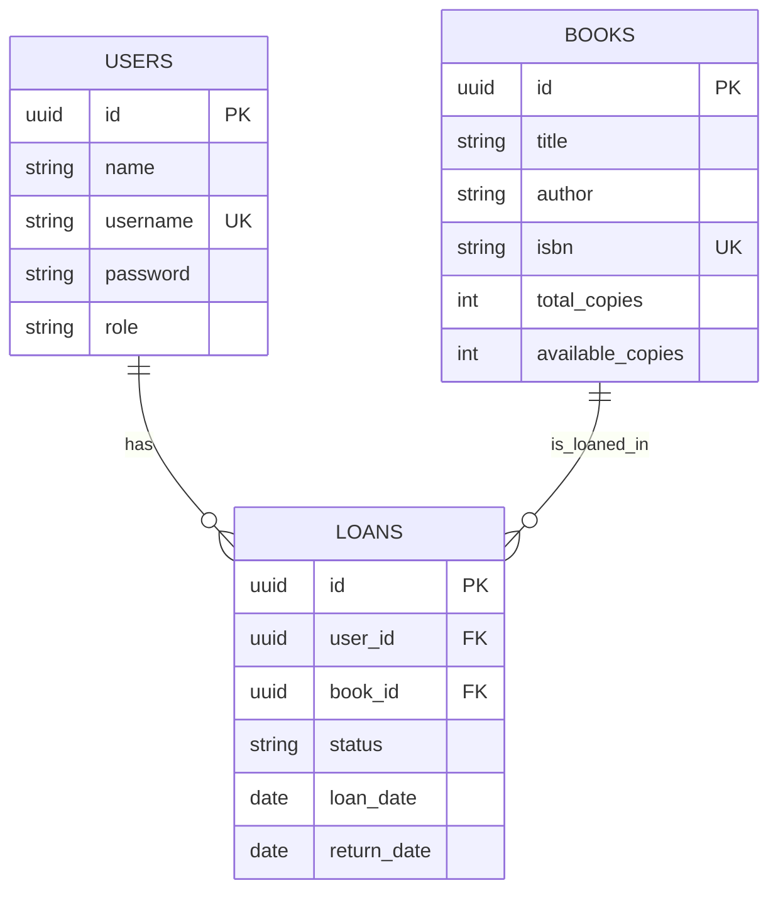

# DOSW-Library

API REST para gestion de biblioteca con:

- Persistencia relacional con Spring Data JPA
- PostgreSQL como base principal
- JWT stateless con Spring Security
- Roles `LIBRARIAN` y `USER`
- Inventario de libros por existencias totales y disponibles
- Swagger/OpenAPI
- Pruebas funcionales con H2

## Arquitectura

- `controller`: endpoints REST, DTOs y manejo HTTP
- `core`: dominio, reglas de negocio, validadores y servicios
- `persistence`: entidades JPA, repositorios y mappers MapStruct
- `security`: autenticacion JWT, filtro, autorizacion y CORS

## Modelo ER



## Configuracion

La aplicacion toma sus valores desde `src/main/resources/application.yaml`.

Variables principales:

- `DB_URL`
- `DB_USERNAME`
- `DB_PASSWORD`
- `JWT_SECRET`
- `JWT_EXPIRATION_MS`
- `CORS_ALLOWED_ORIGINS`
- `SSL_ENABLED`
- `SSL_KEY_STORE`
- `SSL_KEY_STORE_PASSWORD`
- `SSL_KEY_STORE_TYPE`
- `SSL_KEY_ALIAS`

Ejemplo para PostgreSQL local:

```powershell
$env:DB_URL="jdbc:postgresql://localhost:5432/dosw_library"
$env:DB_USERNAME="postgres"
$env:DB_PASSWORD="postgres"
./mvnw spring-boot:run
```

## Usuario bootstrap

Al iniciar la aplicacion se crea un bibliotecario por defecto si no existe:

- `username`: `admin`
- `password`: `Admin123*`

## Seguridad

- Login: `POST /auth/login`
- Header requerido para endpoints protegidos:

```text
Authorization: Bearer <token>
```

- `LIBRARIAN`: gestiona libros, usuarios y consulta todos los prestamos
- `USER`: consulta libros disponibles, solicita prestamos, devuelve libros y consulta solo sus prestamos

## Swagger

- UI: `http://localhost:8080/swagger-ui.html`
- OpenAPI JSON: `http://localhost:8080/api-docs`

## HTTPS

La aplicacion soporta SSL/TLS por propiedades. Para activarlo configure:

- `SSL_ENABLED=true`
- `SSL_KEY_STORE`
- `SSL_KEY_STORE_PASSWORD`
- `SSL_KEY_STORE_TYPE`
- `SSL_KEY_ALIAS`

## Pruebas

```powershell
./mvnw test
./mvnw pmd:pmd
```

Las pruebas usan H2 con el perfil `test` y validan:

- autenticacion JWT
- rechazo sin token
- rechazo con token invalido
- rechazo por rol incorrecto
- persistencia de usuarios, libros y prestamos
- actualizacion de inventario al prestar y devolver

## La ejecucion de las funcionalidades de su API


## La ejecucion de las pruebas de los servicios 


## la cobertura y analisis estatico


