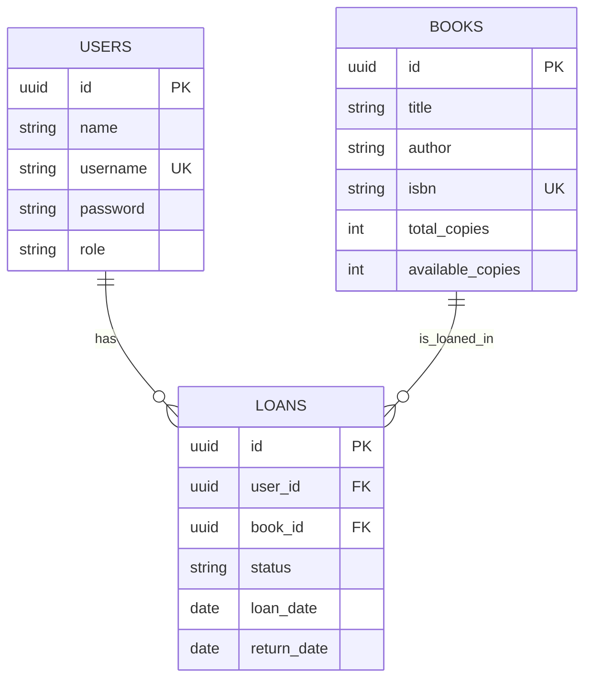

# DOSW-Library

Proyecto de clase para administrar una biblioteca por medio de una API REST construida con Spring Boot. La aplicacion permite autenticar usuarios, registrar libros, consultar inventario y gestionar prestamos con control de roles.

## 1. Resumen

| Tema | Detalle |
| --- | --- |
| Nombre del proyecto | DOSW-Library |
| Tipo de aplicacion | API REST |
| Framework principal | Spring Boot 3.3.4 |
| Lenguaje | Java 21 |
| Persistencia principal | PostgreSQL con Spring Data JPA |
| Seguridad | JWT stateless con Spring Security |
| Documentacion | Swagger / OpenAPI |
| Perfil de pruebas | test con H2 en memoria |

## 2. Funcionalidades principales

| Modulo | Que hace |
| --- | --- |
| Autenticacion | Valida credenciales y entrega un token JWT |
| Usuarios | Permite crear usuarios y consultar informacion del usuario autenticado o del listado completo |
| Libros | Registra libros, actualiza datos del inventario y consulta disponibilidad |
| Prestamos | Crea prestamos, registra devoluciones y consulta prestamos activos |
| Seguridad | Restringe acceso segun el rol del usuario |

## 3. Tecnologias usadas

| Tecnologia | Uso dentro del proyecto |
| --- | --- |
| Spring Boot | Configuracion general y arranque de la aplicacion |
| Spring Web | Exposicion de endpoints REST |
| Spring Security | Autenticacion y autorizacion |
| JWT | Generacion y validacion de tokens |
| Spring Data JPA | Acceso a datos relacional |
| PostgreSQL | Base de datos principal |
| H2 | Base de datos en memoria para pruebas |
| MongoDB | Soporte adicional por perfil `mongo` |
| MapStruct | Conversion entre entidades, DTOs y modelos |
| Lombok | Reduccion de codigo repetitivo |
| JaCoCo | Reporte de cobertura |
| PMD | Analisis estatico |

## 4. Modelo del dominio

El dominio esta compuesto por tres entidades principales: usuarios, libros y prestamos. Un usuario puede tener varios prestamos y cada prestamo hace referencia a un libro.



### Reglas de negocio

- Un libro no se puede registrar con `availableCopies` mayor que `totalCopies`.
- Un usuario no puede tomar un libro si no hay existencias disponibles.
- Un usuario solo puede tener hasta 3 prestamos activos al mismo tiempo.
- Cuando se crea un prestamo, el inventario disponible disminuye en 1.
- Cuando se registra una devolucion, el inventario disponible aumenta en 1.
- Solo el bibliotecario puede crear usuarios, registrar libros y consultar todos los prestamos.

## 5. Estructura del proyecto

| Ruta | Contenido |
| --- | --- |
| `src/main/java/.../tdd/controller` | Controladores REST, DTOs y mappers de entrada/salida |
| `src/main/java/.../tdd/core` | Modelos del dominio, servicios, validadores y reglas de negocio |
| `src/main/java/.../tdd/persistence/relational` | Entidades JPA, repositorios y adapters para PostgreSQL |
| `src/main/java/.../tdd/persistence/nonrelational` | Adapters y mappers para el perfil Mongo |
| `src/main/java/.../security` | Login, JWT, filtro de autenticacion y configuracion de seguridad |
| `src/test/java` | Pruebas de integracion y pruebas de servicios |

## 6. Seguridad y roles

La API usa autenticacion por token. Despues del login, el cliente debe enviar el JWT en el encabezado:

```text
Authorization: Bearer <token>
```

### Usuario bootstrap

Al arrancar la aplicacion se crea un bibliotecario por defecto si todavia no existe.

| Campo | Valor |
| --- | --- |
| Username | `admin` |
| Password | `Admin123*` |
| Rol | `LIBRARIAN` |

### Roles disponibles

| Rol | Acceso |
| --- | --- |
| `LIBRARIAN` | Crear usuarios, crear/actualizar libros, consultar usuarios y ver todos los prestamos |
| `USER` | Consultar libros, pedir prestamos, devolver libros y consultar sus propios prestamos |

## 7. Endpoints principales

| Metodo | Ruta | Rol requerido | Descripcion |
| --- | --- | --- | --- |
| `POST` | `/auth/login` | Publico | Inicia sesion y genera el JWT |
| `POST` | `/users` | `LIBRARIAN` | Crea un usuario |
| `GET` | `/users` | `LIBRARIAN` | Lista todos los usuarios |
| `GET` | `/users/{id}` | `LIBRARIAN` | Consulta un usuario por id |
| `GET` | `/users/me` | `LIBRARIAN`, `USER` | Consulta el usuario autenticado |
| `POST` | `/books` | `LIBRARIAN` | Registra un libro |
| `PUT` | `/books/{id}` | `LIBRARIAN` | Actualiza un libro |
| `GET` | `/books` | `LIBRARIAN`, `USER` | Lista todos los libros |
| `GET` | `/books/available` | `LIBRARIAN`, `USER` | Lista solo libros con disponibilidad |
| `GET` | `/books/{id}` | `LIBRARIAN`, `USER` | Consulta un libro por id |
| `POST` | `/loans` | `LIBRARIAN`, `USER` | Crea un prestamo |
| `PUT` | `/loans/{id}/return` | `LIBRARIAN`, `USER` | Registra la devolucion de un prestamo |
| `GET` | `/loans` | `LIBRARIAN` | Lista todos los prestamos |
| `GET` | `/loans/{id}` | `LIBRARIAN` | Consulta un prestamo por id |
| `GET` | `/loans/me` | `LIBRARIAN`, `USER` | Lista los prestamos del usuario autenticado |

## 8. Ejecucion del proyecto

### Requisitos

| Requisito | Version recomendada |
| --- | --- |
| Java | 21 |
| Maven Wrapper | Incluido en el proyecto |
| PostgreSQL | 15 o superior |
| MongoDB | Solo si se desea usar el perfil `mongo` |

### Variables de entorno

| Variable | Uso | Valor por defecto |
| --- | --- | --- |
| `SPRING_PROFILES_ACTIVE` | Perfil activo | `jpa` |
| `DB_URL` | URL JDBC para PostgreSQL | `jdbc:postgresql://localhost:5432/dosw_library` |
| `DB_USERNAME` | Usuario de base de datos | `postgres` |
| `DB_PASSWORD` | Contrasena de base de datos | `postgres` |
| `MONGODB_URI` | Conexion MongoDB | `mongodb://localhost:27017/dosw_library` |
| `JWT_SECRET` | Clave para firmar JWT | valor definido en `application.yaml` |
| `JWT_EXPIRATION_MS` | Duracion del token | `3600000` |
| `CORS_ALLOWED_ORIGINS` | Origenes permitidos | `http://localhost:3000,http://localhost:5173` |
| `SERVER_PORT` | Puerto HTTP | `8080` |

### Ejecucion con PostgreSQL

1. Crear la base de datos:

```sql
CREATE DATABASE dosw_library;
```

2. Configurar variables en PowerShell:

```powershell
$env:SPRING_PROFILES_ACTIVE="jpa"
$env:DB_URL="jdbc:postgresql://localhost:5432/dosw_library"
$env:DB_USERNAME="postgres"
$env:DB_PASSWORD="postgres"
./mvnw spring-boot:run
```

Con el perfil `jpa`, Hibernate actualiza el esquema al iniciar gracias a `spring.jpa.hibernate.ddl-auto=update`.

### Ejecucion con MongoDB

El proyecto tambien tiene soporte por perfil `mongo`. Si quieres arrancarlo con esa configuracion:

```powershell
$env:SPRING_PROFILES_ACTIVE="mongo"
$env:MONGODB_URI="mongodb://localhost:27017/dosw_library"
./mvnw spring-boot:run
```

## 9. Ejemplos rapidos de uso

### Login

```http
POST /auth/login
Content-Type: application/json

{
  "username": "admin",
  "password": "Admin123*"
}
```

Respuesta esperada:

```json
{
  "token": "eyJhbGciOiJIUzI1NiJ9...",
  "tokenType": "Bearer",
  "expiresIn": 3600000,
  "userId": "9f8d7c6b-1234-4567-890a-bcdef1234567",
  "username": "admin",
  "role": "LIBRARIAN"
}
```

### Crear un libro

```http
POST /books
Authorization: Bearer <token>
Content-Type: application/json

{
  "title": "Clean Code",
  "author": "Robert C. Martin",
  "isbn": "9780132350884",
  "totalCopies": 5,
  "availableCopies": 5
}
```

### Registrar un prestamo

```http
POST /loans
Authorization: Bearer <token>
Content-Type: application/json

{
  "bookId": "9b2d88f3-8f27-4bf8-a3ad-9c711db3e214"
}
```

## 10. Documentacion de la API

| Recurso | URL |
| --- | --- |
| Swagger UI | `http://localhost:8080/swagger-ui.html` |
| OpenAPI JSON | `http://localhost:8080/api-docs` |

## 11. Pruebas y calidad

Las pruebas automatizadas se ejecutan con el perfil `test`, que usa H2 en memoria. En esa configuracion no hace falta levantar PostgreSQL ni MongoDB.

| Comando | Proposito |
| --- | --- |
| `./mvnw clean test` | Ejecuta la suite completa de pruebas |
| `./mvnw pmd:pmd` | Ejecuta analisis estatico con PMD |

Actualmente la suite valida, entre otras cosas:

- autenticacion con JWT
- rechazo de peticiones sin token o con token invalido
- autorizacion por rol
- persistencia de usuarios, libros y prestamos
- actualizacion del inventario cuando se presta o devuelve un libro

## 12. Evidencias

### Video

Antes de entregar el proyecto, cambia este enlace por el video real:

[Video de pruebas funcionales y persistencia](https://example.com/reemplace-por-su-enlace-de-video)

### Capturas

#### Ejecucion de la API


#### Ejecucion de pruebas


#### Cobertura y analisis estatico


